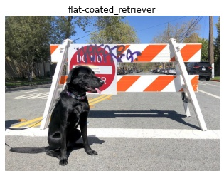

# Introduction to OpenVINO

Basic introduction that shows basic operations using OpenVINO, including inference on a given IR model.

This notebook demonstrates usage of [MobileNet V3](https://github.com/openvinotoolkit/open_model_zoo/blob/master/models/public/mobilenet-v3-small-1.0-224-tf/README.md) from [Open Model Zoo](https://github.com/openvinotoolkit/open_model_zoo/)

# Installation Instructions

If you have not done so already, please follow the [Installation Guide](../../README.md) to install all required dependencies. 
