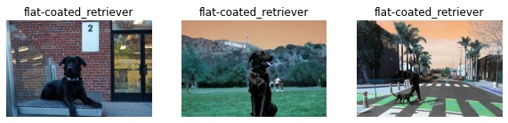

# OpenVINO API tutorial

This notebook explains the basics of the OpenVINO Inference Engine API.
It provides segmentation and classification IR model and a segmentation ONNX model as an example, you can replace these model files with own models.
Despite exact output being different, process remains the same.

## Installation Instructions

If you have not done so already, please follow the [Installation Guide](../../README.md) to install all required dependencies.
