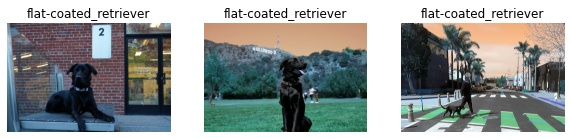

# Tensorflow to OpenVINO conversion tutorial

This notebook explains how to convert [TensorFlow](www.tensorflow.org) model to OpenVINO IR with FP16 precision. It will be explained on converting [TensorFlow MobilenetV3 model](https://github.com/tensorflow/models/tree/master/research/slim/nets/mobilenet).

## Installation Instructions

If you have not done so already, please follow the [Installation Guide](../../README.md) to install all required dependencies.
