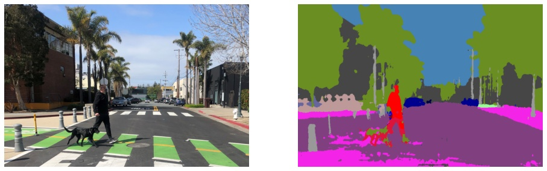

# PyTorch to ONNX and OpenVINO IR tutorial

This notebook demonstrates how to perform inference on a PyTorch semantic segmentation model using [OpenVINO](https://github.com/openvinotoolkit/openvino).

## Content table

Notebook uses Model Optimizer to convert open source [fastseg](https://github.com/ekzhang/fastseg/) semantic segmentation model, trained on [CityScapes](https://www.cityscapes-dataset.com).

## Installation Instructions

If you have not done so already, please follow the [Installation Guide](../../README.md) to install all required dependencies.
