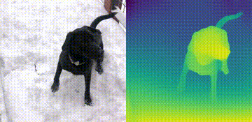

# Monodepth Demo

Monocular Depth Estimation is the task of estimating scene depth using a single image. It has many potential applications in robotics, 3D reconstruction, medical imaging and autonomous systems. For this demo, we use a neural network model called MiDaS which was developed by the Intelligent Systems Lab at Intel. Check out their research paper to learn more.

R. Ranftl, K. Lasinger, D. Hafner, K. Schindler and V. Koltun, "Towards
Robust Monocular Depth Estimation: Mixing Datasets for Zero-shot
Cross-dataset Transfer," in IEEE Transactions on Pattern Analysis and Machine
Intelligence, doi: 10.1109/TPAMI.2020.3019967.

This notebook demonstrates Monocular Depth Estimation with the MidasNet model
in OpenVINO.
https://github.com/openvinotoolkit/open_model_zoo/blob/master/models/public/midasnet/midasnet.md

# Installation Instructions

If you have not done so already, please follow the [Installation Guide](../../README.md) to install all required dependencies. 
