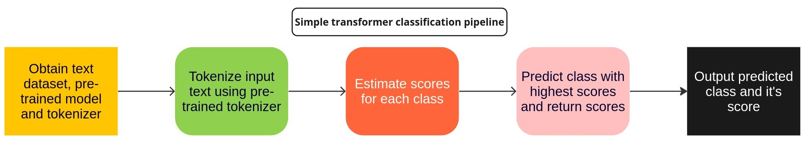

# Convert and Optimize DistilRoBERTa-Emotion-Classification with OpenVINO™

## Basic pipeline used by `DistilRoBERTa` for emotion classification is shown below:


### This tutorial explains how to convert and optimize the [DistilRoBERTa](https://huggingface.co/j-hartmann/emotion-english-distilroberta-base) Transformer model with [OpenVINO](https://docs.openvino.ai/2022.1/index.html) and [Optimum](https://huggingface.co/docs/optimum/index).

## Conversion and optimization process used by the notebook: 


### DistilRoBERTa usage and results\*: 

\*(Taken from [this link](https://huggingface.co/j-hartmann/emotion-english-distilroberta-base#application-%F0%9F%9A%80))

```python
from transformers import pipeline
classifier = pipeline("text-classification", model="j-hartmann/emotion-english-distilroberta-base", return_all_scores=True)
classifier("I love this!")
```

```python
Output:
[[{'label': 'anger', 'score': 0.004419783595949411},
  {'label': 'disgust', 'score': 0.0016119900392368436},
  {'label': 'fear', 'score': 0.0004138521908316761},
  {'label': 'joy', 'score': 0.9771687984466553},
  {'label': 'neutral', 'score': 0.005764586851000786},
  {'label': 'sadness', 'score': 0.002092392183840275},
  {'label': 'surprise', 'score': 0.008528684265911579}]]
```


## Notebook Contents

The tutorial provides a step-by-step demonstration about how to run and optimize DistrilRoBERTa (fine tuned for emotion classification) with OpenVINO.

The tutorial consists of the following steps:
- Installations and imports
- Setting up dataset
- Validating original model
- Converting model to OpenVINO IR
- Optimizing the model
- Deleting created directories
- References

## Installation Instructions

If you have not installed all required dependencies, follow the [Installation Guide](../../README.md).
Additional requirements are installed by running the initial codeblocks which are present inside the notebook itself.

