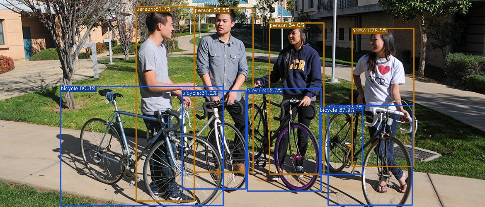

# Object Detection using YOLOX with OpenVINO™

Object detection is an important field in computer vision that enables machines to recognize and locate objects in images or videos. It has various applications in autonomous vehicles, surveillance systems, and medical imaging. 

YOLOX, an improved version of the YOLO (You Only Look Once) model, is advantageous in that it achieves state-of-the-art accuracy while being significantly faster than other object detection models, making it ideal for real-time applications. Its superior speed and accuracy make it a popular choice for computer vision researchers and practitioners.

## Notebook Contents

This notebook demonstrates Object Detection with OpenVINO by using the [YOLOX](https://github.com/Megvii-BaseDetection/YOLOX) model.

## Installation Instructions

If you have not installed all required dependencies, follow the [Installation Guide](../../README.md).
