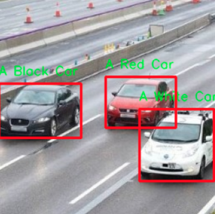
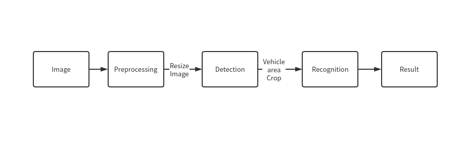

# Vehicle Detection And Recognition with OpenVINO

Thousands of vehicles are running in road.We can detect a single vehicle from a raw image and recognize attributes of vehicles.In this notebook,we use detection model and recognition model to realize the target.

## Notebook Contents

In this notebook, we will use both detection model and classification model with OpenVINO.We use [Object Detection Models](https://github.com/openvinotoolkit/open_model_zoo/tree/master/models/intel/vehicle-detection-0200) and [Object Recognition Models](https://github.com/openvinotoolkit/open_model_zoo/tree/master/models/intel/vehicle-attributes-recognition-barrier-0039) from [Intel Open Model Zoo](https://github.com/openvinotoolkit/open_model_zoo/blob/master/models/intel/index.md).Detection model is used to detect vehicle position.Besides, we crop single vehicle and infer with classification model to recognize attributes of single vehicle.The pipline is here： 

For more information about the pre-trained models, refer to the [Intel](https://github.com/openvinotoolkit/open_model_zoo/tree/master/models/intel) and [public](https://github.com/openvinotoolkit/open_model_zoo/tree/master/models/public) models documentation. All included in the [Open Model Zoo](https://github.com/openvinotoolkit/open_model_zoo)

## Installation Instructions

If you have not done so already, please follow the [Installation Guide](../../README.md) to install all required dependencies.