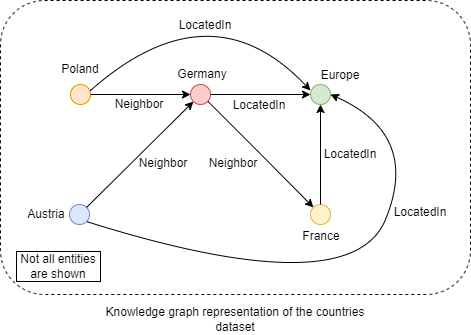

# Knowledge graphs model optimization using the Intel OpenVINO toolkit
[Knowledge graphs](https://arxiv.org/pdf/2002.00388.pdf) provide an efficient way to represent domain information and are used in a number of real-world applications.   
Commonly, knowledge graphs are used to encode domain information by representing them as factual triples of source, relation and target entities.
For ex. For the countries domain, the domain knowledge can be encoded by representing the countries as entities (for ex. Germany, Poland) and relation between them (Neighbor) as factual triples (Poland, Neighbor, Germany) as well as other information as follows:

    

These representations can then be used for tasks such as entity prediction (predict the target entity given the source entity and relation) and link prediction (whether a factual link exists between two given entities). However, such entity and link prediction tasks on large ontologies or knowledge bases can be challenging and time consuming as they can contain millions of factual triples. Hence several neural networks based embedding models have been proposed in recent literature for efficient representation of knowledge graphs.   
In this notebook, we showcase how runtime (latency and throughput) performance of knowledge graph inference or prediction tasks can be further optimized on supported Intel® architectures by using the Intel® Distribution of OpenVINO™ Toolkit for one such knowledge graph embeddings model called ConvE.   
The ConvE knowledge graph embeddings model is an implementation of the paper Convolutional 2D Knowledge Graph Embeddings by Tim Dettmers et al. (https://arxiv.org/abs/1707.01476).
