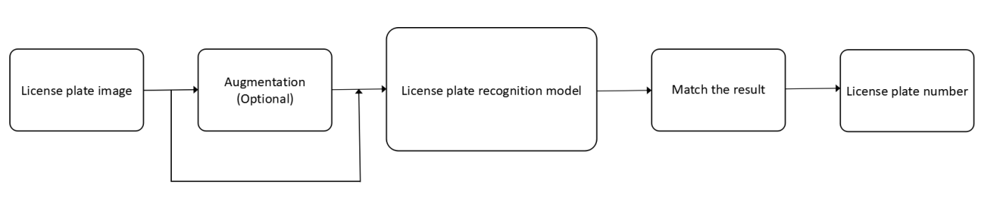
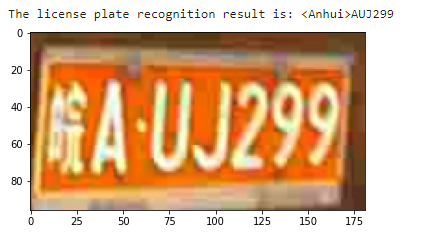

# License Plate Recognition with OpenVINO

License plate recognition model helps you get the chinese license plate number precisely in no time. The input of the color license plate image can be any size. It will be resized and augmented before put into the model. After matching the result to correct character, we can get the license plate number. In the notebook we show how to create the following pipeline:

And the result is:

## Notebook Contents

This notebook demonstrates license plate recognition with OpenVINO. We use the [License Plate Recognition Model](https://docs.openvino.ai/2020.2/_models_intel_license_plate_recognition_barrier_0001_description_license_plate_recognition_barrier_0001.html) from [Open Model Zoo](https://github.com/openvinotoolkit/open_model_zoo/). This model uses a small-footprint network trained end-to-end to recognize Chinese license plates in traffic.

Here is the [Jupyter notebook](220-license-plate-recognition.ipynb)

## Installation Instructions

If you have not done so already, please follow the [Installation Guide](../../README.md) to install all required dependencies.
