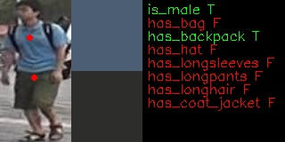

# Title of Tutorial

Person attributes recognition crossroad-0230. This model presents a person attributes classification algorithm analysis scenario. It produces probability of person attributions existing on the sample and a position of two point on sample, whiches can be used for color prob (like, color picker in graphical editors).

## Notebook Contents

This notebook uses the model to check that the corresponding attributes are present in the picture

| Attribute         |  F1   |
|-------------------|-------|
| `is_male`         | 0.91  |
| `has_bag`         | 0.66  |
| `has_backpack`    | 0.77  |
| `has_hat`         | 0.64  |
| `has_longsleeves` | 0.21  |
| `has_longpants`   | 0.83  |
| `has_longhair`    | 0.83  |
| `has_coat_jacket` |  NA   |

This notebook realizes two functions, one is for video processing, the other is for image processing

* [Video Notebook](220-person-attributes-recognition-crossroad-image.ipynb)
* [Image Notebook](220-person-attributes-recognition-crossroad-video.ipynb)

## Installation Instructions

You can find an introduction to the model [here](https://github.com/openvinotoolkit/open_model_zoo/tree/master/models/intel/person-attributes-recognition-crossroad-0230).