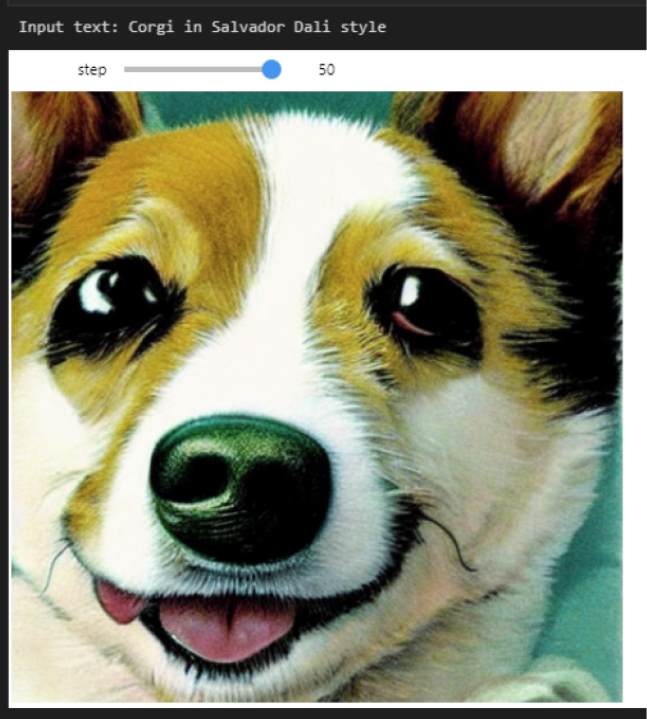

# Text-to-image generation with Stable Diffusion

Text-to-image generation is task of AI, which aim is create image from given text description.
In this demo we use the **[Stable Diffusion](https://huggingface.co/CompVis/stable-diffusion)** model for image generation with OpenVINO.

The complete pipeline of this demo's notebook is shown below.

This is a demonstration in which the user can type the text and the pipeline will generate an image that reflects the context of the given text, step by step iteratively denoise latent image representation while being conditioned on the text embeddings provided by text encoder. 

The following image shows an example of the input sequence and corresponding predicted image.

## Notebook Contents

This notebook demonstrates how to convert and run stable diffusion using OpenVINO.

Notebook contains the following steps:
1. Convert PyTorch models to ONNX format.
2. Convert ONNX models to OpenVINO IR format using Model Optimizer tool.
3. Run Stable Diffusion pipeline with OpenVINO.

## Installation Instructions

If you have not done so already, please follow the [Installation Guide](https://github.com/openvinotoolkit/openvino_notebooks/blob/main/README.md") to install all required dependencies.