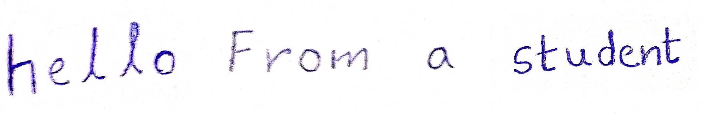

# Handwritten english text recognition

helle from a student

In this tutorial we implement [handwritten-english-recognition-0001](https://github.com/openvinotoolkit/open_model_zoo/tree/master/models/intel/handwritten-english-recognition-0001) model. Following model is used to recognize english text from a piece of handwriting.

## Notebook Contents

Main steps covered in the notebook
- Download the xml file of pre-trined model using omz-downloader tool.
- Load the model with required precision and get the shape for input and output layer
- Resize the input image(handwriting) into the input shape of the model and feed the input to model
- Decode the result obtained from the model.

## Installation Instructions

If you have not done so already, please follow the [Installation Guide](../../README.md) to install all required dependencies.

