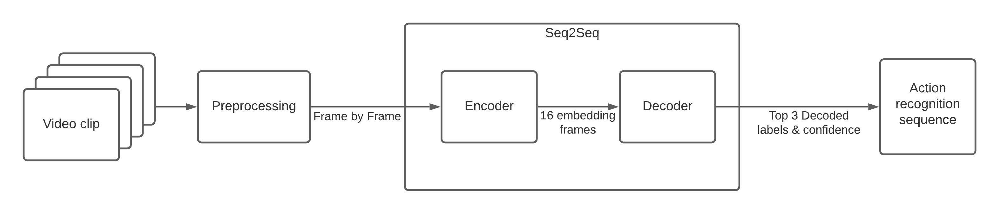

# Human Action Recognition OpenVINO

This notebook demonstrates live human action recognition with OpenVINO. We use the [Action Recognition Models](https://docs.openvino.ai/2020.2/usergroup13.html) from [Open Model Zoo](https://github.com/openvinotoolkit/open_model_zoo), specifically the [Encoder](https://docs.openvino.ai/2020.2/_models_intel_action_recognition_0001_encoder_description_action_recognition_0001_encoder.html) and [Decoder](https://docs.openvino.ai/2020.2/_models_intel_action_recognition_0001_decoder_description_action_recognition_0001_decoder.html). Both models create a sequence to sequence (`"seq2seq"`)[1](#f1) system to identify the  human activities for [Kinetics-400 dataset](https://deepmind.com/research/open-source/kinetics). The models use the Video Transformer approach with ResNet34 encoder[2](#f2). We will see in this notebook how to create the following pipeline:

At the bottom of this notebook, you will see live inference results from your webcam. You can also upload a video file.

NOTE: _To use the webcam, you must run this Jupyter notebook on a computer with a webcam. If you run on a server, the webcam will not work. However, you can still do inference on a video in the final step._

<b id="f1">1</b> seq2seq: Deep learning models that take a sequence of items to the input and output. In this case, input: video frames, output: actions sequence. This `"seq2seq"` is composed of an encoder and a decoder. The encoder captures the `"context"` of the inputs to be analyzed by the decoder, and finally gets the human action and confidence.[$\hookleftarrow$](#a1)

<b id="f2">2</b>  [Video Transformer](https://en.wikipedia.org/wiki/Transformer_(machine_learning_model)#:~:text=A%20transformer%20is%20a%20deep,in%20computer%20vision%20(CV).), and [ResNet34](https://www.kaggle.com/pytorch/resnet34). [$\hookleftarrow$](#a2)

For more information about the pre-trained models, refer to the [Intel](https://github.com/openvinotoolkit/open_model_zoo/tree/master/models/intel) and [public](https://github.com/openvinotoolkit/open_model_zoo/tree/master/models/public) models documentation. All included in the [Open Model Zoo](https://github.com/openvinotoolkit/open_model_zoo)

## Demo Output

In the bottom part of the notebook, you can find the result of running `"action-recognition-model"` using your webcam and a loaded video.

## See Also

* [OpenVINO notebooks](https://github.com/openvinotoolkit/openvino_notebooks)
* [Model Optimizer](https://docs.openvinotoolkit.org/latest/_docs_MO_DG_Deep_Learning_Model_Optimizer_DevGuide.html)
* [Action Recognition Demo (OpenVINO - No notebooks)](https://docs.openvino.ai/latest/omz_demos_action_recognition_demo_python.html)
