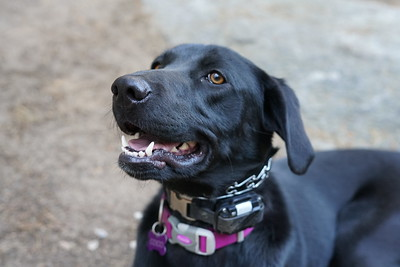

## List of Notebooks

Each notebook is located in a directory. Please follow the instructions in the [README](https://github.com/openvinotoolkit/openvino_notebooks/) before launching Jupyter Lab or Jupyter Notebook.

| Notebook      | Description | Preview     |
| :---:        |    :---   |          :----: |
| [001-hello-world](001-hello-world/001-hello-world.ipynb) | <ul><li>A very basic introduction to OpenVINO's [Python API](https://docs.openvinotoolkit.org/latest/ie_python_api/annotated.html)</li><li>Shows how to do inference on a [mobilenetv3](https://docs.openvinotoolkit.org/latest/omz_models_model_mobilenet_v3_small_1_0_224_tf.html) image classification model</li></ul> |  `['n02099267', 'flat-coated_retriever']`   |
| [002-openvino-api](002-openvino-api/002-openvino-api.ipynb)   | OpenVINO API tutorial that covers the following: <ul><li>Load Inference Engine and Show Info</li><li>Loading a Model</li><ul><li>IR Model</li><li>ONNX Model</li></ul><li>Getting Information about a Model</li><ul><li>Model Inputs</li><li>Model Outputs</li></ul><li>Doing Inference on a Model</li><li>Reshaping and Resizing</li><ul><li>Change Image Size</li><li>Change Batch Size</li></ul></ul> |   |
| [101-tensorflow-to-openvino](101-tensorflow-to-openvino/101-tensorflow-to-openvino.ipynb) | <ul><li>Demonstrates how to convert [TensorFlow](https://www.tensorflow.org/) models to OpenVINO IR</li><li>Uses Model Optimizer to convert the same [mobilenetv3](https://docs.openvinotoolkit.org/latest/omz_models_model_mobilenet_v3_small_1_0_224_tf.html) image classification model from `001-hello-world` notebook</li></ul> |  `['n02099267', 'flat-coated_retriever']`   |
| [102-pytorch-onnx-to-openvino](102-pytorch-onnx-to-openvino/102-pytorch-onnx-to-openvino.ipynb) | <ul><li>Demonstrates how to convert [PyTorch](https://pytorch.org/) models to OpenVINO IR</li><li>Uses Model Optimizer to convert the open source [fastseg](https://docs.openvinotoolkit.org/latest/omz_models_model_mobilenet_v3_small_1_0_224_tf.html) semantic segmentation model</li></ul> |   |
| [103-paddle-onnx-to-openvino](103-paddle-onnx-to-openvino/103-paddle-onnx-to-openvino.ipynb) | <ul><li>Demonstrates how to convert [PaddlePaddle](https://github.com/PaddlePaddle/Paddle) models to OpenVINO IR</li><li>Uses Model Optimizer to convert the open source [mobilenet_v3_large_imagenet_ssld](https://www.paddlepaddle.org.cn/hubdetail?name=mobilenet_v3_large_imagenet_ssld&en_category=ImageClassification) image classification model</li></ul> |  `[{'Labrador retriever': 0.600349485874176}]`  |
| [104-model-tools](104-model-tools/104-model-tools.ipynb) |  |  |
| [201-vision-monodepth](201-vision-monodepth/201-vision-monodepth.ipynb) |  |  |
| [202-vision-superresolution-image](202-vision-superresolution/202-vision-superresolution-image.ipynb) |  |  |
| [202-vision-superresolution-video](202-vision-superresolution/202-vision-superresolution-video.ipynb) |  |  |
| [205-vision-background-removal](205-vision-background-removal/205-vision-background-removal.ipynb) |  |  |
| [206-vision-paddlegan-anime](206-vision-paddlegan-anime/206-vision-paddlegan-anime.ipynb) |  |  |
| [301-tensorflow-training-openvino](301-tensorflow-training-openvino/301-tensorflow-training-openvino.ipynb) |  |  |
| [301-tensorflow-training-openvino-pot](301-tensorflow-training-openvino/301-tensorflow-training-openvino-pot.ipynb) |  |  |
