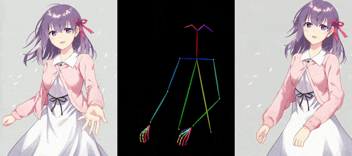

# Image-to-video synthesis with AnimateAnyone and OpenVINO

[AnimateAnyone](https://arxiv.org/pdf/2311.17117.pdf) tackles the task of generating animation sequences from a single character image. It builds upon diffusion models pre-trained on vast character image datasets.

The core of AnimateAnyone is a diffusion model pre-trained on a massive dataset of character images. This model learns the underlying character representation and distribution, allowing for realistic and diverse character animation.
To capture the specific details and characteristics of the input character image, AnimateAnyone incorporates a ReferenceNet module. This module acts like an attention mechanism, focusing on the input image and guiding the animation process to stay consistent with the original character's appearance. AnimateAnyone enables control over the character's pose during animation. This might involve using techniques like parametric pose embedding or direct pose vector input, allowing for the creation of various character actions and movements. To ensure smooth transitions and temporal coherence throughout the animation sequence, AnimateAnyone incorporates temporal modeling techniques. This may involve recurrent architectures like LSTMs or transformers that capture the temporal dependencies between video frames.

Overall, AnimateAnyone combines a powerful pre-trained diffusion model with a character-specific attention mechanism (ReferenceNet), pose guidance, and temporal modeling to achieve controllable, high-fidelity character animation from a single image.

Learn more in [GitHub repo](https://github.com/MooreThreads/Moore-AnimateAnyone) and [paper](https://arxiv.org/pdf/2311.17117.pdf).

## Notebook contents
The tutorial consists from following steps:
- Prerequisites
- Prepare base model
- Prepare image encoder
- Download weights
- Initialize models
- Load pretrained weights
- Convert model to OpenVINO IR
    - VAE
    - Reference UNet
    - Denoising UNet
    - Pose Guider
    - Image Encoder
- Inference
- Video post-processing
- Interactive inference

## Installation instructions
This is a self-contained example that relies solely on its own code. 
We recommend running the notebook in a virtual environment. You only need a Jupyter server to start.
For details, please refer to [Installation Guide](../../README.md).

