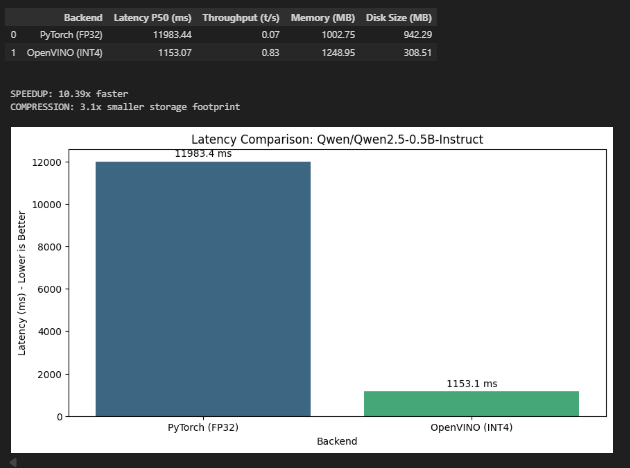

# ⚡ Transformer Quantization Benchmark: PyTorch vs. OpenVINO


A modular benchmarking framework designed to measure the **inference performance gap** between standard PyTorch (FP32) and optimized OpenVINO (INT4) runtimes for Large Language Models (LLMs) on CPU.

> **Key Result:** Achieved a **~9.4x Speedup** and **4x Storage Reduction** on Qwen2.5-0.5B-Instruct.

## 🚀 Overview

Running LLMs on consumer hardware (laptops, edge devices) is challenging due to high latency and memory usage. This project demonstrates how **NNCF (Neural Network Compression Framework)** and **INT4 Quantization** can unlock real-time performance on standard CPUs.

**This benchmark measures:**
* **Latency (P50):** Median time to generate a token (Chat responsiveness).
* **Throughput:** Total tokens generated per second.
* **Memory Footprint:** RAM usage during generation.
* **Disk Size:** Storage efficiency of the quantized model.

## 📊 Benchmark Results (Sample)


## 📂 Project Structure

```text
benchmark-transformer-quantization/
├── bench/
│   ├── kv_cache.py       # Memory management & Garbage collection
│   ├── metrics.py        # System-level monitoring (RAM/Disk)
│   ├── model_loader.py   # Handles FP32 loading & INT4 export
│   └── runner.py         # Warmup & Measurement loop
├── configs/
│   └── benchmark_config.yaml  # Easy-to-tune parameters
├── benchmark-transformer.ipynb  # 📖 Main Tutorial Notebook
├── requirements.txt      # Dependencies
└── README.md             # This file


🛠️ Quick Start
1. Install Dependencies Ensure you have Python 3.8+ installed.
pip install -r requirements.txt


2. Run the Benchmark Open the Jupyter Notebook and execute all cells.
jupyter lab benchmark-transformer-notebook.ipynb

The notebook acts as a guided tutorial, explaining the "Heavy vs. Light" quantization concept with visuals.

⚙️ Configuration
You can tweak configs/benchmark_config.yaml to test different models or settings:

YAML
model:
  id: "Qwen/Qwen2.5-0.5B-Instruct"  # Change to any Hugging Face model
benchmark:
  warmup_iterations: 3
  measure_iterations: 15


🧠 Technical Details
Quantization: Uses optimum-intel to compress weights from 32-bit Floating Point to 4-bit Integers (INT4).

Metric Collection: Uses psutil for accurate RSS memory tracking.

State Management: Implements aggressive Garbage Collection (gc.collect()) between runs to ensure fair memory comparisons on limited hardware.