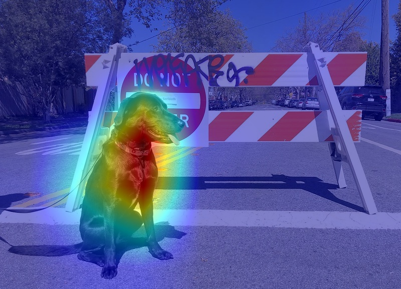

# OpenVINO™ Explainable AI Toolkit: Classification Explanation

**OpenVINO™ Explainable AI (XAI) Toolkit** provides a suite of XAI algorithms for visual explanation of
[**OpenVINO™**](https://github.com/openvinotoolkit/openvino) Intermediate Representation (IR) models.

Using **OpenVINO XAI**, you can generate **saliency maps** that highlight regions of interest in input images from the model's perspective. This helps users understand why complex AI models produce specific responses.

This notebook shows an example how to use OpenVINO XAI.

It depicts a heatmap with areas of interest where neural network (classification or detection) focuses before making a decision.

Example: Saliency map for `flat-coated retriever` class for MobileNetV3 classification model:

## Notebook Contents

The tutorial consists of the following steps:

- Run explainer in Auto-mode
- Specify preprocess and postprocess functions
- Run explainer in White-box mode
    - Insert XAI branch to use updated model in own pipelines
- Run explainer in Black-box mode
- Advanced: add label names and use them to save saliency maps instead of label indexes 

These are explainable AI algorithms supported by OpenVINO XAI :

| Domain          | Task                 | Type      | Algorithm           | Links |
|-----------------|----------------------|-----------|---------------------|-------|
| Computer Vision | Image Classification | White-Box | ReciproCAM          | [arxiv](https://arxiv.org/abs/2209.14074) / [src](https://github.com/openvinotoolkit/openvino_xai/blob/releases/1.0.0/openvino_xai/methods/white_box/recipro_cam.py) |
|                 |                      |           | VITReciproCAM  (for transformer models)     | [arxiv](https://arxiv.org/abs/2310.02588) / [src](https://github.com/openvinotoolkit/openvino_xai/blob/releases/1.0.0/openvino_xai/methods/white_box/recipro_cam.py) |
|                 |                      |           | ActivationMap       | experimental / [src](https://github.com/openvinotoolkit/openvino_xai/blob/releases/1.0.0/openvino_xai/methods/white_box/activation_map.py) |
|                   |                    | Black-Box | RISE                | [arxiv](https://arxiv.org/abs/1806.07421v3) / [src](https://github.com/openvinotoolkit/openvino_xai/blob/releases/1.0.0/openvino_xai/methods/black_box/rise.py) |
|                 | Object Detection     |           | ClassProbabilityMap | experimental / [src](https://github.com/openvinotoolkit/openvino_xai/blob/releases/1.0.0/openvino_xai/methods/white_box/det_class_probability_map.py) |