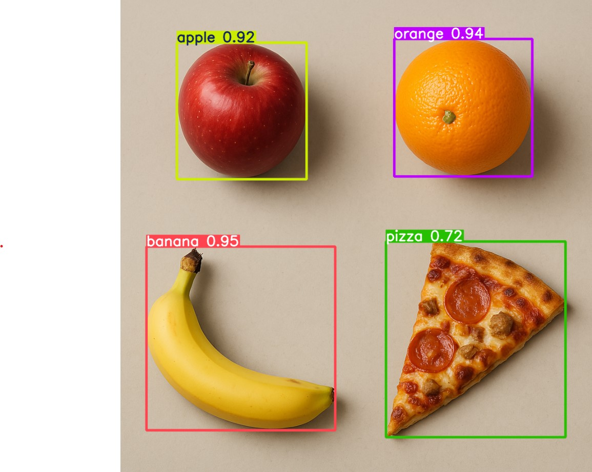

# Object Detection and Classification Pipeline with YOLO and OpenVINO™

This notebook demonstrates how to build a complete object detection and classification pipeline using YOLO models with OpenVINO™. The pipeline includes object detection using YOLOv11, cropping detected objects, classification using YOLO classification model, and performance comparison across different devices (CPU, GPU, NPU).

## Notebook Contents

The notebook is organized into the following sections:

1. **Prerequisites**  
   Install required packages for the notebook.

2. **Imports**  
   Import necessary Python libraries and initialize OpenVINO.

3. **Download Models**  
   Download YOLOv11n for object detection and YOLOv11n-cls for classification.

4. **Basic Inference without OpenVINO**  
   Run detection using the PyTorch model to establish a baseline.

5. **Convert to OpenVINO Format**  
   - Convert Detection Model to OpenVINO IR format  
   - Convert Classification Model to OpenVINO IR format

6. **Select Inference Device**  
   Choose the hardware device (CPU, GPU, NPU) for inference.

7. **Run Object Detection**  
   Perform object detection using OpenVINO on the selected device.

8. **Extract Detected Objects**  
   Crop detected objects from the original image.

9. **Classify Detected Objects**  
   Run classification on each cropped object using the YOLO classification model.

10. **Complete Pipeline**  
    Combine detection, cropping, and classification into a single optimized pipeline.

11. **Performance Comparison**  
    Compare pipeline performance across different device configurations.

## Key Features

- **Device Flexibility**: Run inference on CPU, GPU, or NPU
- **Model Conversion**: Convert YOLO models to OpenVINO IR format for optimized performance
- **Complete Pipeline**: Demonstrates end-to-end object detection and classification workflow
- **Performance Analysis**: Measure and compare inference times across different hardware accelerators
- **Interactive Widgets**: Use dropdown menus to easily select inference devices

## Installation Instructions

This is a self-contained example that relies solely on its own code.

We recommend running the notebook in a virtual environment. You only need a Jupyter server to start.
For details, please refer to [Installation Guide](../../README.md).

